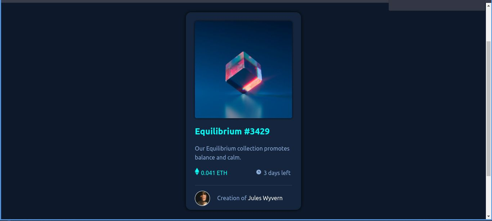

# Frontend Mentor - NFT preview card component solution

This is a solution to the [NFT preview card component challenge on Frontend Mentor](https://www.frontendmentor.io/challenges/nft-preview-card-component-SbdUL_w0U). Frontend Mentor challenges help you improve your coding skills by building realistic projects. 

## Índice

- [Overview](#overview)
  - [O desafio](#the-challenge)
  - [Screenshot](#screenshot)
  - [Links](#links)
- [Autor](#author)

## Overview

### O desafio

Os usuários devem conseguir:

- Ver o layout independente do tamanho de sua tela
- Ver o efeito de hover para elementos animados

### Screenshot

### Links

- URL do site: [https://nft-preview-card-eta.vercel.app/](https://nft-preview-card-eta.vercel.app/)

## Autor

- LinkedIn - [Lucas Santiago](https://www.linkedin.com/in/lucas-santiago-dev/)

